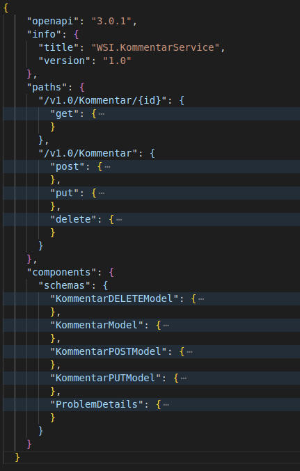
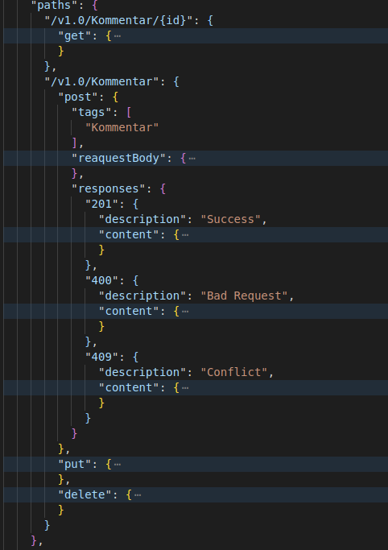

# Aufgaben Antowerten

## 1. Beschreiben Sie mindestens 3 Services inkl. Bounded Context, Context Map, Datenmodel und Datenvalidierung

### Service 1: Kommentarservice

Dieser Service ist nur zuständig Kommentare zu einer Resource mit einer UUID zu verwalten.  

Mit Datenvalidierung können die Einstellungen eines Kommentars überprüft werden, ob diese richtig erstellt werden. (Bei erstellung der Kopfkommentars, wenn eine Maximallänge der untergeordneten Kommentare eingeschränkt werden möchte.) Weites wird generell Validiert, ob die Eingabe des Users richtig ist.

Zu einem Kommentar gehört:
 * Id
 * Title
 * Username
 * Kommentar
 * Datumsfelder: Erstellt, Bearbeitet, Letzte Änderung
 * Kommentareinstellungen: WeitereKommentareErlauben, MaximalKomentarlänge
 * Infofelder:
   * Um ein Kommentar zu anderen Kommentaren zuordnen zu können
   * KopfId, ÜbergeordneterKommentarId, NächsteKommentarId, VorherigeKommentarId
 * Lese-Berechtigungs-Schlüssel: Um ein Kommentar auch "geheim" zu halten. Es können nur User mit Kommentar-Id und LeseSchlüssel darauf zugreifen.
 * SchreibSchlüssel: Damit nur eine Person diese Kommentar bearbeiten und löschen kann.

### Serivce 2: Image-Service

Im Image-Service werden nur Bilder gespeichert, diese werdne auf Inhalt überprüft, damit kein ungewünschter Inhalt im WWW verbreitet wird. Der Serive kann auch das Bild in verscheiden Größer transformieren und Thumbnails, Icon und anderes Dateiformat erstellen.

Hier gibt es kein Datenmodel. Die Valdierung und Bearbeitung des Bildes passiert mit einer Library.

### Service 3: Translation-Service

Diese Service ist zuständig um einen Text in eine andere gewünschte Sprache zu übersetzten.  
Es gibt kein Datnemodel da nur eine Textdatei zur übersetzung gesendet wird. Die Datenvalidierung wird mit dem Routing und einer Tabelle mit allen verfügbaren sprachen gemacht. Die tatsächliche Übersetzung passiert mit eine externen Programm und KI.

### Bounded Context

Diese drei Services können nun als Forum eingesetzt werden.  

Der Client (=Forum) speichert Kategorie und ermöglicht das Verfassen von Beiträgen mit dem Kommentarservice. 

Der Client ist auch dafür zuständig, dass durch Kommentare keine Sicherheitslücke entsteht und mögliche HTML-Elemente escaped.

Bei den Beiträgen können auch Bilder embedded werden, indem im Kommentar einfach eine spezielle Zeichenfolge eingefügt wrid um ein Bild zu referenzieren. z.B.
 > Hallo, hier ein Bild von meiner Katz:  
 > {image:uuid:width:height}  
 > Ich hoffe es hat dir gefallen.  
 > Lg. User  

Am Client wird dann {image:uuid:width:height} mit einem entsprechenden HTML-Element ausgetauscht: 

Zuletzt kann der Client die Kommentare übersetzten, idem der Translation-Service aufgerufen wird.

Durch diese Mikroservices kann dieses Forum sehr gut skalieren.

Der Kommentarservice muss nichts von Bilder wissen und auch nicht verstehen, wie dieses Kommentar in einer anderen Sprache aussieht.

## 2. Entwicklen Sie mindestens einen ASP.NET Core Web.API  Controller, welcher CRUD-Funktionaltitäten zur Verfügung stellt. Beschreiben Sie die REST-Prinzipien im Zusammenhang mit Ihrem Projekt.

 > Implementierung

## 3. Beschreiben Sie die OpenAPI-Spec Ihres Service. Stellen Sie IDL, WSDL und OpenApi-Spec gegenüber.

### OpenAPI-Spec

 * openpi: Version
 * Info: Information über Schnitstelle
 * paths: Hier sind alle Endpunkte beschrieben, die Aufrufbar sind.
 * components: Hier ist die Definition über die Datenmodelle die unter "paths" verwendet werden.

Unter Paths sind alle Endpunkte und deren Rout-Values beschrieben. Eine Ebene darunter werden die erlaubten HTTP-Methoden beschrieben.  
 * requestBody: Hier wird beschrieben welche Datenformat verwendbar sind und es wird zu den "components" welche Daten im Request-Body enthalten sein müssen.
 * response: Beschreibt den Status-Code und referenziert wiederum zu "components" um Datenformat zu definieren.

## 4. Erstellen Sie eine Service-Klasse, welche per Dependency Injection aus Ihrem Service aufgerufen wird.

 > Implementierung

## 5. Erstellen Sie eine Client-Applikation, welche Ihr erstelltes Service verwendet. Die Technologie bleibt dabei Ihnen überlassen (C#-Console-App, Java, JavaScript, Python,..).

 > Implementierung

## 6. Beschreiben Sie das Thema Routing im Allgemeinen. Definieren Sie mindestesn eine Route, welche nicht dem ASP.NET Core-Standard entspricht

Routing wird verwendet um Programmteile logisch zu trennen und einzuteilen, und um Variablen aus der URL zu entnehmen. Damit kann sichergestellt werden, dass die benötigten Variablen immer befüllt sind und der richtige Programmcode ausgeführt wird.

Beispiel: 
 * /api/v1.0/{kontinent}/{staat}/Einwoher/Anzahl
 * /api/v1.0/{kontinent}/{staat}/Corona/{provinz}/Inzidenz
Diese zwei Routen beschreiben, wie man die z.B. von einem Staat von einem Kontinent die Anzahl der Einwohner bekommt und die Aktuellen Inzidenz-Zahlen einer bestimmten Provinz

## 7. Verwenden Sie Einträge aus der „appsettings.json“.

 > Implementierung

## 8. Aufbereitung und Präsentation

 > Präsentation

## 9. Funktionierende Gesamtlösung

 > Implementierung

## 10. Entwickeln Sie einen weiteren ASP.NET Core Web.API  Controller, bei welchem die einzelnen Methoden (GET, POST, PUT,DELETE) nur mit einem gültigen API Key aufgerufen werden dürfen. Demonstrieren Sie sowohl das Verhalten bei Verwendung eines gültigen API Keys als auch das Verhalten bei Verwendung eines falschen API Keys. Vergleichen Sie den Einsatz von API Keys mit OAuth und beschreiben Sie mögliche Anwendungsszenarien und Vor- und Nachteile

 > Implementierung und Antwort

### Vor- und Nachteile von API-Keys zu OAuth

Vorteile:
 * Einfach zu erstellen und zu verwenden
Nachteile:
 * Nur beschränkt verwendbar, wenn es nur einen Schlüssel gibt.
 * Keine automaitsche Erstellung von Access-Token für verschieden User.
 * OAuth-Access-Tokens können einfacher revoked werden.
 * Geben Zugriff auf ganze Applikation, OAuth hat scopes und kann daher beschränkten zugriff gewähren.
